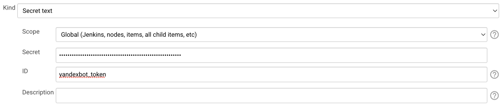
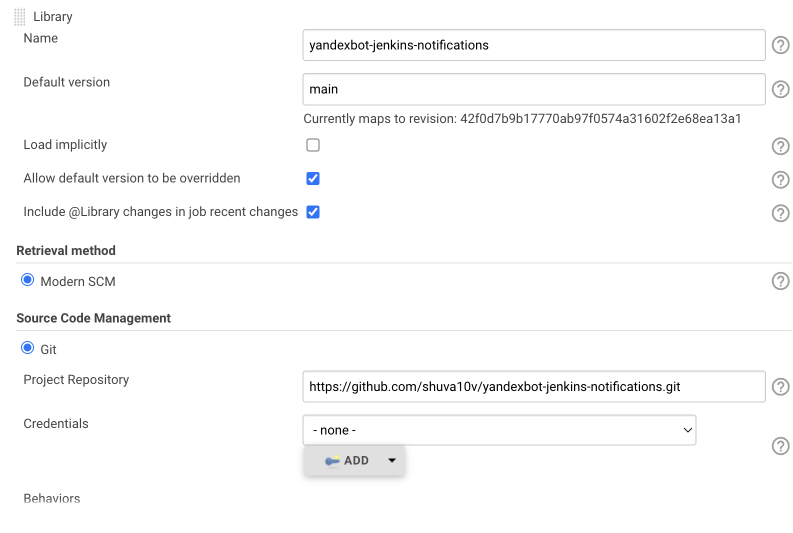
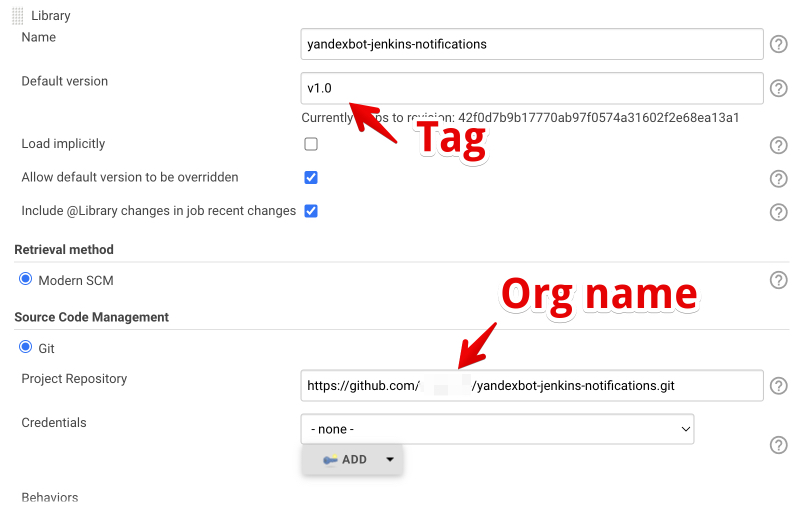

# yandexbot-jenkins-notifications

## Installation

1. Create credentials with bot token with ID ``yandexbot_token``:

2. Go to Manage Jenkins => Configure System => Global Pipeline Libraries and add
this library as follows:

3. Create test pipeline job like this [example.Jenkinsfile](./example.Jenkinsfile). 
Replace ``CHANNEL_ID_HERE`` from [example.Jenkinsfile](./example.Jenkinsfile) with
real chat id.

## Notes on production usage

Global pipeline libraries has full permissions on your Jenkins instance. 
For production use create a fork and use tag (i.e., v1.0):

## See also

1. [Official Yandex Bot documentation](https://botapi.messenger.yandex.net/docs/)
2. [Extending Jenkins Pipeline with Shared Libraries](https://www.jenkins.io/doc/book/pipeline/shared-libraries/)